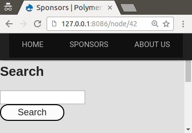

# Tutorial: Styling button



## Steps

There is already a `<mm-button>` element in Monomer theme. To style it, we only need to override the style module (`mm-button-styles.html`).

Create the following file in your theme:

`my-elements/mm-button/mm-button-styles.html`:

```html
<link rel="import" href="../polymer/polymer.html">
<!--
/**
 * @file
 * Styles for <mm-button>.
 */
-->
<dom-module id="mm-button-styles">
  <template>
    <style>
      :host {
        display: block;
        /* font */
        color: black;
        font-size: 20px;
        font-family: helvetica;

        /* remove blue underline */
        text-decoration: none;

        /* border */
        border: 2px solid black;
        border-radius: 20px;

        /* transitions */
        transition-duration: .2s;
        -webkit-transition-duration: .2s;
        -moz-transition-duration: .2s;

        /* other */
        background-color: white;
        padding: 4px 30px;

        -webkit-appearance: none;
        -moz-appearance: none;
      }
      :host(:hover) {
        /* update text color and background color */
        color:white;
        background-color:black;

        /* transitions */
        transition-duration: .2s;
        -webkit-transition-duration: .11s;
        -moz-transition-duration: .2s;
      }

    </style>
  </template>
</dom-module>
```

You may put in any CSS styling you like.
