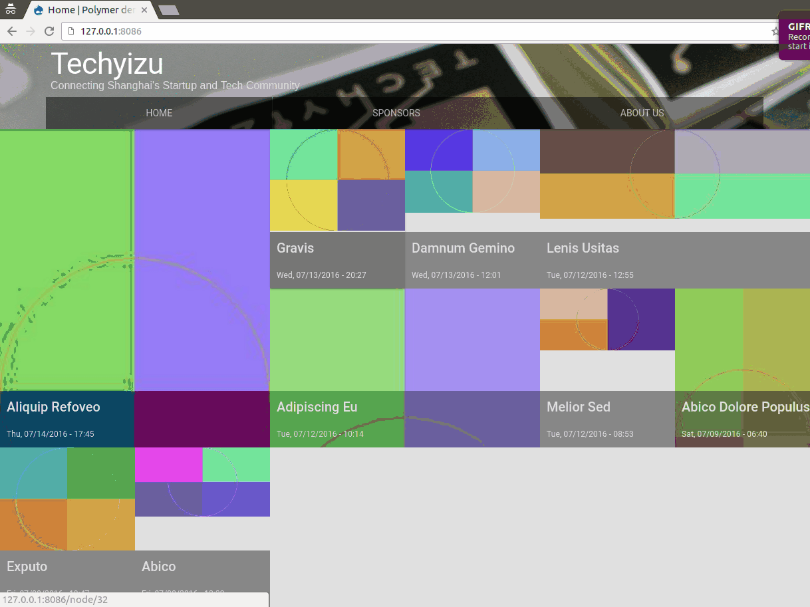
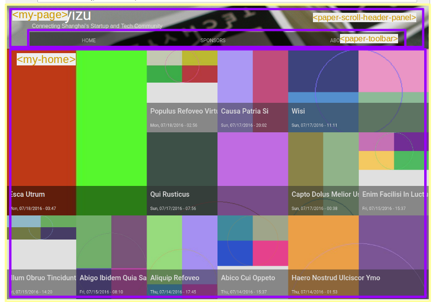
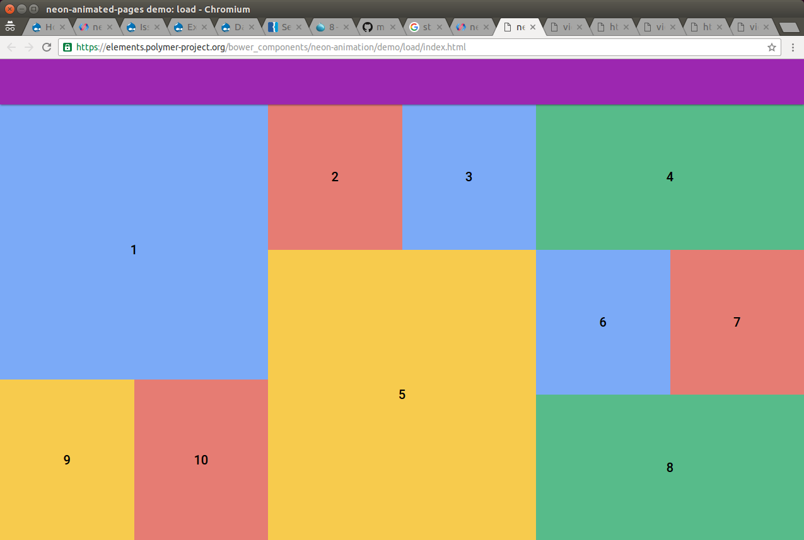

# Tutorial: Building a simple studio site with Monomer base theme in Drupal 8

Before reading this, make sure you have read [Getting Started Guide](guide.md).

## Table of contents
- [Goal](#goal)
- [Setting up folder structure](#setting-up-folder-structure)
- [Drupal Configuration](#drupal-configuration)
- [An anatomy of page layout](#an-anatomy-of-page-layout)
- [Step 1: set up basic page layout](#step-1-set-up-basic-page-layout)
- [Step 2: auto-collapse header](#step-2-auto-collapse-header)
- [Step 3: main menu](#step-3-main-menu)
- [Step 4: front page view with animations](#step-4-front-page-view-with-animations)
- [Step 5: content pages](#step-5-content-pages)
- [Step 6: fade-in effects on content pages](#step-6-fade-in-effects-on-content-pages)

## Goal
We are building a website like this:



Check out the [Live demo](http://monomerdemok87tjp6c5v.devcloud.acquia-sites.com/) or [Code repo](https://github.com/ztl8702/polymer-demo).


## Setting up folder structure
 - Create a `studio` folder in `themes` folder of your Drupal 8 installation.
 - Create a `studio.info.yml` file in your theme folder.
```yaml
name: Studio
type: theme
core: 8.x
base theme: monomer
description: 'A demo studio theme using Polymer base theme.'
package: Web Components
regions:
  header: Header
  primary_menu: 'Primary menu'
  highlighted: Highlighted
  content: Content
libraries-override:
  classy/base: false
```
- Run `bower init`, follow the instructions.
- Your theme folder structure should look like this:
```
├── bower_components
│   └── ... (3rd party Web Components, installed by bower)
├── bower.json
├── my-elements
│   └── ... (Custom built Polymer elements)
├── studio.info.yml
├── studio.libraries.yml
├── studio.theme
└── templates
    └── ...
```
 - Optionally, you can add a `.gitignore` file and exclude `bower_components` from your repository.

## Drupal Configuration

The site we are creating has two content types. To keep things simple, we are going to configure them as: 
  - Event (machine name: `event`). 
    - Body field
    - Image field
  - Basic Page (machine name: `page`).
    - Body field
    - Image field

We also want to put the Main Navigation menu in the region `Primary menu`.

For the front page, we are going to modify the `frontpage` view to displaying 12 nodes maximum.

Create a new "Markdown" editor format, which doesn't do any processing on the content. We will use it later.

## An anatomy of page layout


We are going to create 3 custom Polymer elements:
 - `<my-page>`: Overall page wrapper.
 - `<my-home>`: Frontpage view.
 - `<my-node>`: Displaying node content.

Our `my-elements/` folder will eventually look like this:
```
my-elements/
├── my-home
│   ├── my-home.html
│   └── my-home-styles.html
├── my-node
│   ├── my-node.html
│   └── my-node-styles.html
└── my-page
    ├── image
    │   └── techyizu_header_bg.jpg
    ├── my-page.html
    └── my-page-styles.html
```

> Tip: If you have Drupal Console installed, you can use the command `drupal polymer:element` to generate the boilerplate code for your Polymer element.

## Step 1: set up basic page layout
Override the template `page.html.twig` to use our `<my-page>` element.

`templates/page.html.twig`:

```twig

<div class="layout-container">
  <my-page>
    <header role="banner">
      {{ page.header }}
    </header>
    {{ page.primary_menu }}
    {{ page.highlighted }}
    <a id="main-content" tabindex="-1"></a>{# link is in html.html.twig #}
    <my-app-content>
      {{ page.content }}
    </my-app-content>{# /.layout-content #}
    
      <footer role="contentinfo">
        {{ page.footer }}
      </footer>
    
  </my-page>
</div>{# /.layout-container #}
```

`my-elements/my-page/my-page.html`:

```html
...
<template>
  <content select="paper-tabs">
  </content>
  <content select="my-app-content"></content>
</template>
...
```
## Step 2: Auto-collapse header
We are going to use `<paper-scroll-header-panel>` element. First install it via Bower.

```
> bower install --save PolymerElements/paper-scroll-header-panel
```

`my-elements/my-page/my-page.html`:

```html
...
<paper-scroll-header-panel condenses keep-condensed-header header-height="128" condensed-header-height="48">

  <paper-toolbar id="toolbar">
    <div class="spacer"></div>
    <div class="middle indent bottom-text">
      <div class="title">[[ siteName ]]</div>
      <div class="subtitle">[[ siteSlogan ]]</div>
    </div>
    <content select="paper-tabs">
    </content>
  </paper-toolbar>

  <div class="content">
   <content select="my-app-content"></content>
  </div>

</paper-scroll-header-panel>
...
```

> Note that we used `[[ siteName ]]` and `[[ siteSlogan ]]` in our **DOM template**. To display site name and site slogan, we first need to write a preprocess function:
>
> `studio.theme`:
>
>```php
>function studio_preprocess_page(array &$variables) {
>  $config = \Drupal::config('system.site');
>  $variables['site_name'] = $config->get('name');
>  $variables['site_slogan'] = $config->get('slogan');
>}
>```
> and pass the variable into the element as attributes:
> `templates/page.html.twig`:
>
>```twig
>  <my-page site-name="{{ site_name }}"
>           site-slogan="{{ site_slogan }}">
>  ...
>```
> then in the Polymer element definition, add this to the `properties` object:
>
> `my-elements/my-page/my-page.html`:
> ```js
> properties: {
>   siteName: String,
>   siteSlogan: String,
>   ...
> }
>```

Add styles accordingly (see [code](https://github.com/ztl8702/polymer-demo/themes/studio/my-elements/my-page/my-page-styles.html)).

See also: [`<paper-scroll-header-panel>` docs on Polymer Catalog](https://elements.polymer-project.org/elements/paper-scroll-header-panel)

## Step 3: Main menu
We will use `<paper-tabs>` for the main menu, which automatically includes ripple effects on tap.

`templates/menu--main.html.twig`:
```twig
<paper-tabs self-end{{ attributes.addClass(wrapper_classes) }}>
    
        
        <paper-tab link{{ item.attributes.addClass(classes) }}>
            {{ link(item.title, item.url) }}
        </paper-tab>
    
</paper-tabs>
```

Also, modify the block and region templates to get rid of excessive wrappers:

`templates/block--system-menu-block--main.html.twig`:
```twig
{{ content }}
```

`templates/region--primary-menu.html.twig`:
```twig
{{ content }}
```

## Step 4: Front page view with animations

As showcased at the beginning, we want our frontpage view to have an entry animation, based on [this official demo](https://elements.polymer-project.org/bower_components/neon-animation/demo/load/index.html).


The difference is, instead of loading data from JSON api, the "tiles" actually output by Drupal's Views module and put into the page as **LightDOM children**.

First, override template to make each view row a tile:
`node--view--frontpage.html.twig`:
```
<a class="event-link" href="{{ url }}"{{ attributes }}>
    <div class="chip-top" style="background-image:url({{ file_url(node.field_image.entity.fileuri) }})"></div>
    <div class="chip-bottom">
        <div class="chip-title">{{ node.getTitle() | raw }}</div>
        <div class="chip-date">{{ date }}</div>
    </div>
</a>
```
And wrap all the view rows with our `<my-home>` element:

`views-view--frontpage.html.twig`:
```

<my-home>
    {{ rows }}
</my-home>
```

In the definition of `<my-home>` element:

Simply add:


`my-elements/my-home/my-home.html`:
```twig
 <content></content>
```
in the **DOM template**.

And define animation configuration:

`my-elements/my-home/my-home.html`:
```js
Polymer({
    is: 'my-home',
    behaviors: [
      Polymer.NeonSharedElementAnimatableBehavior,
      Polymer.NeonAnimationRunnerBehavior
    ],
    properties: {
      animationConfig: {
        type: Object,
        value: function() {
          return {
            'entry': [{
              name: 'cascaded-animation',
              animation: 'transform-animation',
              transformFrom: 'translateY(100%)',
              transformTo: 'none',
              timing: {
                delay: 100  // So that tiles will slide in at different time.
              }
            }],
          }
        }
      }
    },
  ...
```

Now here is the key part: assign the target elements to play animation on.

We utilize the `ready` lifecycle callback, and first get the **LightDOM children**, add them to the animation configuration object (` this.animationConfig['entry'][0].nodes `),
then play the animation.

`my-elements/my-home/my-home.html`:
```js
ready: function() {
  var distributed = this.getContentChildren('content');
  this.animationConfig['entry'][0].nodes = Array.prototype.slice.call(distributed);
  this.playAnimation('entry');
}
```

As for CSS you may largely follow [the official demo](https://github.com/PolymerElements/neon-animation/blob/master/demo/load/animated-grid.html#L26),
but remember to rewrite CSS selectors using `::content` and `:host::content`. Example:
```css
:host::content .tile:nth-of-type(1),
::content .tile:nth-of-type(1) {
    opacity: 1;
    width: calc(100% / 3);
    height: calc(100% / 3 * 2);
}
:host::content .tile:nth-of-type(4) ,
::content .tile:nth-of-type(4) {
    width: calc(100% / 3);
}
```

See also: [Neon animations](https://elements.polymer-project.org/elements/neon-animation)
## Step 5: Content pages
This step is easy, just create a `<my-node>` element to display and style all content pages.

In this site we are building, we use Markdown to write node body, and render the content client side using the [`<marked-element>`](https://elements.polymer-project.org/elements/marked-element).

`my-elements/my-node/my-node.html`:
```html
<dom-module id="my-node">
...
  <template>
    <style include="my-node-styles"></style>
    
    <content select="marked-element"></content>
  </template>

  <script>
    Polymer({
      is: 'my-node',

      behaviors: [
        Polymer.NeonAnimationRunnerBehavior,
      ],

      properties: {
       heroImgUrl: {
          type: String,
        },
     　}
...
```

To use the `<my-node>` element, modify the template of the relevant content types:

`templates/node--page.html.twig`:

```twig

<my-node{{ attributes.addClass(classes) }}
         hero-img-url="{{ file_url(node.field_image.entity.fileuri) }}">
    <marked-element>
        <div class="markdown-html"></div>
        <script type="text/markdown">
# {{ node.getTitle() | raw }}
{{ node.body.value | raw }}
      </script>
    </marked-element>
</my-node>
```

Do the same to `templates/node--event.html.twig`.

## Step 6: fade-in effects on content pages

Similar to Step 4, but much simpler. 

Just add `NeonAnimationRunnerBehavior` and `animationConfig`; then run the animation in `ready` function.

See also: [Animation in Monomer theme](https://github.com/ztl8702/polydemo/tree/polymer#animation)
## Drupal-specific tweaks and tricks
